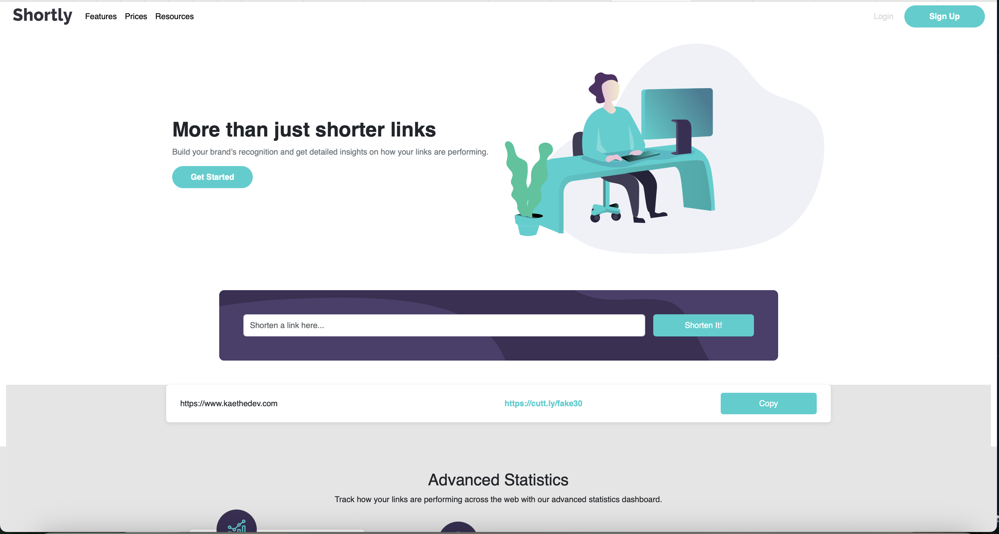

# Frontend Mentor - Shortly URL shortening API Challenge solution

This is a solution to the [Shortly URL shortening API Challenge challenge on Frontend Mentor](https://www.frontendmentor.io/challenges/url-shortening-api-landing-page-2ce3ob-G). Frontend Mentor challenges help you improve your coding skills by building realistic projects. 

## Table of contents

- [Overview](#overview)
  - [The challenge](#the-challenge)
  - [Screenshot](#screenshot)
  - [Links](#links)
- [My process](#my-process)
  - [Built with](#built-with)
  - [What I learned](#what-i-learned)
  - [Continued development](#continued-development)
  - [Useful resources](#useful-resources)
- [Author](#author)
- [Acknowledgments](#acknowledgments)

## Overview

### The challenge

Users should be able to:

- View the optimal layout for the site depending on their device's screen size
- Shorten any valid URL
- See a list of their shortened links, even after refreshing the browser
- Copy the shortened link to their clipboard in a single click
- Receive an error message when the `form` is submitted if:
  - The `input` field is empty

### Screenshot

### Links
- Live Site URL: [GitHub Pages Link](https://kaethedev.github.io/URL-Shortener/)

## My process

I started with Bootstrap and building the full layout first. That left me with enough time to focus on the API integration, semantics and accessibility. 

### Built with

- Bootstrap
- CSS custom properties
- Flexbox
- Mobile-first workflow

### What I learned

I learned how to mix JavaScript with Bootstrap. The last time I attempted it, it didn't work out so well. But I think because I have a better understanding of the DOM I can see that mixing JavaScript with Bootstrap is no different that mixing it with plain HTML. 

### Continued development

Fix the design to get it to match more with the specs.

### Useful resources

- [Bootstrap Documentation](https://getbootstrap.com/docs/5.3/getting-started/introduction/) - This helped for when there were classes or behavior about Bootstap that I did not know.
- [Cuttly Documentation](https://cutt.ly/api-documentation/regular-api) - This is how I learned to implement the Cuttly API
- [Bit.ly](https://dev.bitly.com/api-reference/#createFullBitlink) - Bit.ly documentation for the API

## Author

- Website - [Starving Artist Design & Development](https://www.starvingartistddllc.com)
- Frontend Mentor - [@kaethedev](https://www.frontendmentor.io/profile/kaethedev)
- Twitter - [@kaethedev](https://www.twitter.com/kaethedev)

## Reflection